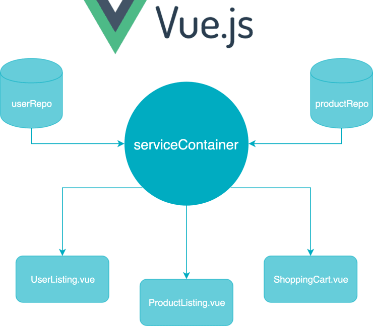

= Лабораторна робота №5

*Тема:* Керування маршрутами з використанням vue-router.

*Мета:* ознайомлення з концепцією маршрутизації в односторінкових додатках (SPA) за допомогою бібліотеки vue-router, застосування патерну Repository для роботи з зовнішнім REST API та реалізація авторизації на основі JWT.

*Вимоги до звіту:*

. Лабораторна робота повинна бути виконана *в окремій гілці* - feature/routing у vue-lottery-app github репозиторію студента.
. При написанні застосунку використати патерн репозиторій (Repository).
. Дотримання TypeScript-типізації;
. Використання Composition API;
. Під час написання застосунку обов'язково дотримуватись https://ua.vuejs.org/style-guide/[style guide];
. Якщо ви використовуєте css бібліотеку, то імпортуйте тільки необхідні стилі (базові, кнопки, таблиці, поля тощо).
Використовуйте scss.
. Використовуйте ESLint;
. Адреса API та інші налаштування середовища мають зберігатися у `.env` файлі (змінна `VITE_API_URL`), а не бути захардкодженими в коді.
Файл `.env` не комітиться, натомість додається `.env.example`.
. Зробити деплой гілки feature/routing на gh-pages.

== Практична частина

=== Самостійна робота студента:

. https://vuejs.org/guide/scaling-up/routing.html[Routing];
. https://vuejs.org/guide/essentials/lifecycle.html[Lifecycle Hooks];
. https://vuejs.org/guide/components/async.html[Async Components];
. https://router.vuejs.org/[The official router for Vue.js];
. https://router.vuejs.org/guide/essentials/dynamic-matching.html[Dynamic Route Matching with Params];
. https://router.vuejs.org/guide/essentials/route-matching-syntax.html[Routes' Matching Syntax];
. https://router.vuejs.org/guide/essentials/nested-routes.html[Nested Routes];
. https://router.vuejs.org/guide/essentials/active-links.html[Active links];
. https://router.vuejs.org/guide/advanced/navigation-guards.html[Navigation Guards];
. https://router.vuejs.org/guide/advanced/meta.html[Route Meta Fields];
. https://router.vuejs.org/guide/advanced/data-fetching.html[Data Fetching];
. https://router.vuejs.org/data-loaders/[Data Loaders];
. https://medium.com/@pirvan.marian/mastering-initial-data-fetching-in-vue-js-a-tutorial-for-modern-web-apps-b899ddbb3976[Mastering Initial Data Fetching in Vue.js];
. https://jwt.io/introduction[Introduction to JSON Web Tokens].

=== Теоретична частина

Маршрутизація (routing) - це механізм, який дозволяє керувати тим, який компонент відображається залежно від URL у браузері.

У класичних сайтах при переході між сторінками браузер повністю перезавантажує сторінку.
У SPA (Single Page Application) з Vue Router перехід між сторінками відбувається без перезавантаження - Vue просто замінює компонент у межах сторінки.

Vue Router - це офіційна бібліотека маршрутизації для Vue.js, яка дозволяє створювати багатосторінкові SPA (Single Page Application) додатки, зберігаючи єдину HTML-сторінку.

Вона дозволяє:

. визначати маршрути (routes), які відповідають певним компонентам;
. переходити між сторінками без перезавантаження браузера;
. працювати з параметрами в URL (наприклад /users/:id);
. використовувати навігаційні переходи, охоронці маршрутів і динамічне завантаження компонентів.

Маршрут (Route) – це зв’язок між шляхом (path) та компонентом (component).

[source,js]
----
{ path: '/users', component: UsersView }
----

Роутер (Router) – це об’єкт, який зберігає конфігурацію маршрутів і відповідає за навігацію.

[source,js]
----
const router = createRouter({
    history: createWebHistory(),
    routes,
})
----

Роутер-в’ю (`<RouterView>`) – компонент, у який динамічно підставляється компонент, що відповідає поточному маршруту.

Роутер-лінк (`<RouterLink>`) – компонент для навігації між маршрутами без перезавантаження сторінки.

[source,vue]
----
<RouterLink to="/users">Users list</RouterLink>
----

Навігаційний guard (navigation guard) – функція, яка виконується до (або після) переходу на маршрут і може дозволити, скасувати або перенаправити навігацію.
Разом з полем `meta` у конфігурації маршруту guard-и використовують для захисту сторінок, що потребують авторизації.

[source,ts]
----
router.beforeEach((to) => {
    const auth = useAuthStore()
    if (to.meta.requiresAuth && !auth.isAuthenticated) {
        return { name: 'login', query: { redirect: to.fullPath } }
    }
})
----

Основні поняття та компоненти паттерну репозиторій:

Патерн репозиторій (Repository Pattern) - це патерн проєктування, який використовується в розробці програмного забезпечення для відокремлення логіки доступу до даних від решти додатку.
Він дозволяє абстрагувати роботу з базою даних або іншими джерелами даних, надаючи спеціалізований інтерфейс для взаємодії з цими джерелами.

Репозиторій (Repository) - клас або інтерфейс, який надає методи для зберігання, отримання, оновлення та видалення об'єктів з бази даних або іншого джерела даних.
Він приховує деталі роботи з базою даних від решти програми.

Модель (Model) - об'єкт, який представляє дані, що зберігаються в базі даних або іншому джерелі даних.
Модель може мати відповідність (mapping) до таблиці бази даних або іншої структури даних.

Клієнтський код (Client Code) - решта додатка, який використовує репозиторій для взаємодії з даними.
Клієнтський код викликає методи репозиторія, а не безпосередньо взаємодіє з базою даних.

Переваги використання патерну репозиторій:

. Розділення відповідальностей - патерн репозиторій дозволяє відокремити логіку доступу до даних від бізнес-логіки програми.
Це полегшує підтримку і рефакторинг.
. Тестованість - оскільки клієнтський код взаємодіє з репозиторієм через інтерфейс, це дозволяє легко тестувати класи, що використовують репозиторій, за допомогою мокінгу або створення фейків.
. Повторне використання - репозиторії можна використовувати в різних частинах програми й навіть в інших проєктах, що сприяє повторному використанню коду.
. Абстракція джерел даних - репозиторій може працювати з різними джерелами даних (наприклад, базою даних, вебсервісами, файлами) і надавати єдиний інтерфейс для роботи з ними.
. Підтримка розширення - зміна джерела даних або реалізації репозиторія може бути виконана без зміни клієнтського коду.
. Зниження ризику помилок - за допомогою репозиторіїв зменшується ризик дублювання коду для доступу до даних та зменшується ймовірність помилок.
. Патерн є корисним у великих проєктах і спрощує управління та розвиток додатків, особливо тих, що взаємодіють зі складними джерелами даних.

==== Приклад реалізації патерну Repository

Нижче наведено приклад для ресурсу `Product` (https://dummyjson.com/docs/products[DummyJSON Products]).
У лабораторній роботі аналогічну структуру необхідно реалізувати для ресурсу `User`.

*1. Модель (Model)* - тип, що описує дані:

[source,ts]
----
// src/types/product.ts
export interface Product {
    id: number
    title: string
    description: string
    price: number
    category: string
}

export type CreateProductDto = Omit<Product, 'id'>
export type UpdateProductDto = Partial<CreateProductDto>
----

*2. Узагальнені інтерфейси (контракти) репозиторію.*
Кожен інтерфейс описує одну можливість, тому сервіс реалізує лише ті, які йому потрібні:

[source,ts]
----
// src/services/interfaces.ts
export interface Readable<T> {
    getAll(params?: { limit?: number; skip?: number }): Promise<T[]>
    getById(id: number): Promise<T>
}

export interface Creatable<T, TCreate> {
    create(data: TCreate): Promise<T>
}

export interface Editable<T, TUpdate> {
    update(id: number, data: TUpdate): Promise<T>
}

export interface Deletable {
    delete(id: number): Promise<void>
}
----

*3. HTTP-клієнт.*
Єдине місце, де відомо про `fetch`, базову адресу та обробку помилок.
Репозиторій не повинен містити хардкоду URL:

[source,ts]
----
// src/api/http-client.ts
const BASE_URL = import.meta.env.VITE_API_URL

export async function http<T>(path: string, options: RequestInit = {}): Promise<T> {
    const response = await fetch(`${BASE_URL}${path}`, {
        headers: { 'Content-Type': 'application/json' },
        ...options,
    })

    if (!response.ok) {
        throw new Error(`HTTP ${response.status}: ${response.statusText}`)
    }

    return response.json() as Promise<T>
}
----

*4. Репозиторій (сервіс)* - клас, що реалізує інтерфейси та приховує деталі роботи з API:

[source,ts]
----
// src/services/product.service.ts
import { http } from '@/api/http-client'
import type { Product, CreateProductDto, UpdateProductDto } from '@/types/product'
import type { Readable, Creatable, Editable, Deletable } from './interfaces'

interface ProductsResponse {
    products: Product[]
    total: number
    skip: number
    limit: number
}

export class ProductService
    implements
        Readable<Product>,
        Creatable<Product, CreateProductDto>,
        Editable<Product, UpdateProductDto>,
        Deletable
{
    async getAll({ limit = 10, skip = 0 } = {}): Promise<Product[]> {
        const data = await http<ProductsResponse>(`/products?limit=${limit}&skip=${skip}`)
        return data.products
    }

    getById(id: number): Promise<Product> {
        return http<Product>(`/products/${id}`)
    }

    create(data: CreateProductDto): Promise<Product> {
        return http<Product>('/products/add', {
            method: 'POST',
            body: JSON.stringify(data),
        })
    }

    update(id: number, data: UpdateProductDto): Promise<Product> {
        return http<Product>(`/products/${id}`, {
            method: 'PUT',
            body: JSON.stringify(data),
        })
    }

    async delete(id: number): Promise<void> {
        await http(`/products/${id}`, { method: 'DELETE' })
    }
}
----

*5. Фабрика `ServiceProvider`* - єдина точка отримання сервісів.
Клієнтський код не створює сервіси самостійно через `new`:

[source,ts]
----
// src/services/service-provider.ts
import { ProductService } from './product.service'

export class ServiceProvider {
    private static productService?: ProductService

    static get products(): ProductService {
        this.productService ??= new ProductService()
        return this.productService
    }
}
----

*6. Клієнтський код (Client Code)* - компонент працює лише з методами репозиторія та нічого не знає про `fetch` чи URL:

[source,vue]
----

----

*7. Тестування.*
Оскільки клієнтський код залежить від інтерфейсу, а не від конкретного класу, реальний сервіс легко замінити фейком:

[source,ts]
----
// src/services/__tests__/fake-product.service.ts
import type { Readable } from '../interfaces'
import type { Product } from '@/types/product'

export class FakeProductService implements Readable<Product> {
    private items: Product[] = [
        { id: 1, title: 'Test', description: 'Test item', price: 10, category: 'test' },
    ]

    async getAll(): Promise<Product[]> {
        return this.items
    }

    async getById(id: number): Promise<Product> {
        const item = this.items.find((p) => p.id === id)
        if (!item) throw new Error('Not found')
        return item
    }
}
----

Якщо в майбутньому джерело даних зміниться (інший API, `localStorage`, GraphQL), достатньо написати нову реалізацію тих самих інтерфейсів - компоненти змінювати не потрібно.

==== Про API, що використовується в роботі

У роботі використовується публічний тестовий REST API https://dummyjson.com[DummyJSON]:

* https://dummyjson.com/docs/users[Users] - ресурс користувачів (список, пошук, отримання за id, створення, оновлення, видалення);
* https://dummyjson.com/docs/auth[Auth] - авторизація за JWT (login, поточний користувач, оновлення токена).

Основні ендпоїнти:

[cols="1,2,3",options="header"]
|===
|Метод |URL |Призначення

|GET |`/users?limit=10&skip=0` |Список користувачів з пагінацією (відповідь: `users`, `total`, `skip`, `limit`)
|GET |`/users/search?q=...` |Пошук користувачів
|GET |`/users/:id` |Користувач за id
|POST |`/users/add` |Створення користувача
|PUT |`/users/:id` |Оновлення користувача
|DELETE |`/users/:id` |Видалення користувача
|POST |`/auth/login` |Логін (`username`, `password`), у відповіді `accessToken` і `refreshToken`
|GET |`/auth/me` |Дані поточного користувача (заголовок `Authorization: Bearer <accessToken>`)
|POST |`/auth/refresh` |Оновлення `accessToken` за `refreshToken`
|===

[IMPORTANT]
====
Операції POST, PUT і DELETE на DummyJSON *лише імітуються*: сервер повертає коректну відповідь, але дані фактично не змінюються.
Тому після створення, оновлення чи видалення користувача студент має самостійно оновити локальний стан (список у Pinia-сторі або `ref`), інакше зміни не буде видно в інтерфейсі.
====

Тестові облікові дані для авторизації: `emilys` / `emilyspass` (інші облікові записи можна взяти з відповіді `GET /users`).

=== Завдання:

** Виконати самостійну роботу студента.
** Проаналізувати схеми даних для Users та Auth (https://dummyjson.com/docs/users[DummyJSON Users], https://dummyjson.com/docs/auth[DummyJSON Auth]).

Використовуючи застосунок vue-lottery-app, виконати наступне:

** Додати до проекту vue-router.
** Додати компонент `<AppHeader>`.
** Додати компонент `<AppNavigation>` з наступними розділами застосунку: Home, About author, Users, Login.
Активний пункт меню має бути візуально виділений (https://router.vuejs.org/guide/essentials/active-links.html[Active links]).
** Додати компонент `<Logo>`.
** На сторінці Home додати інформацію про застосунок (опис проєкту та технології, що використовуються, додати лінк на GitHub проєкту).
** На сторінці About додати інформацію про студента (ПІБ, блок Technical skills, посилання на GitHub акаунт).
** Додати сторінку 404 (catch-all маршрут `/:pathMatch(.*)*`) з посиланням на головну.
** Для сторінок використати ліниве завантаження компонентів (`() => import(...)`).
** При написанні застосунку використати патерн репозиторій (Repository):
*** створити узагальнені (generic) інтерфейси `Readable<T>`, `Creatable<T>`, `Editable<T>`, `Deletable<T>`;
*** створити тип `User` (за схемою DummyJSON) та допоміжні типи для створення й оновлення (`CreateUserDto`, `UpdateUserDto`);
*** створити клас `UserService`, що імплементує відповідні інтерфейси;
*** створити фабрику `ServiceProvider` та додати до неї `UserService` (а також `AuthService`);
*** HTTP-клієнт (fetch або axios) винести в окремий модуль із базовою адресою з `VITE_API_URL`; сервіси не повинні містити хардкоду URL.
** Змінити та заповнити таблицю з учасниками, використовуючи дані з DummyJSON Users.
Реалізувати пагінацію (`limit`/`skip`) та пошук; поточна сторінка й пошуковий запит мають зберігатися в *query-параметрах* URL (наприклад, `/users?page=2&q=john`), щоб посилання на конкретний стан списку можна було скопіювати.
** Реалізувати динамічний роутинг для users, щоб користувач міг отримати повну інформацію про юзера (`/users/:id`).
Параметр `id` передати в компонент через `props: true`.
** Реалізувати вкладений маршрут редагування користувача (`/users/:id/edit`).
** Поля форм для створення та оновлення даних юзера змінити у відповідності до DummyJSON (мінімум: `firstName`, `lastName`, `email`, `username`, `password`, `age`, `gender`, `phone`).
** Врахувати, що операції POST, PUT і DELETE на DummyJSON лише імітуються (дані на сервері не змінюються).
Після успішної відповіді сервера студент має самостійно оновити локальний стан: додати нового користувача до списку, замінити оновленого, видалити видаленого.
Після створення, редагування чи видалення користувач бачить актуальний список без перезавантаження сторінки.
** Реалізувати авторизацію юзера на сторінці `/login`.
Використати `POST /auth/login`; `accessToken` та дані користувача зберігати в сторі (Pinia) і `localStorage`; для запитів до захищених ендпоїнтів (`/auth/me`) додавати заголовок `Authorization: Bearer`.
Якщо юзер авторизований, виводити кнопку з написом "Logout" замість кнопки "Login".
Клік по "Logout" розлогінює юзера, очищає токени, і далі відбувається редірект на сторінку Login.
** Захистити маршрути за допомогою navigation guard та `meta.requiresAuth`: сторінка `/users` (та вкладені) доступна лише авторизованим користувачам; неавторизований користувач перенаправляється на `/login` з параметром `redirect`, після успішного логіну повертається на запитану сторінку.
Авторизований користувач, що відкриває `/login`, перенаправляється на `/users`.
** Показувати стани завантаження та помилки (loading / error) для запитів до API; повідомлення про помилку авторизації виводити у формі.
** Для валідації форм використати бібліотеку https://vee-validate.logaretm.com/v4/[VeeValidate] (разом із yup або zod на вибір): обов'язкові поля, формат email, мінімальна довжина пароля.
** Заголовок вкладки браузера має змінюватися залежно від сторінки (через `meta.title` та `router.afterEach`).
** Реалізувати автоматичне оновлення `accessToken` через `POST /auth/refresh` при відповіді 401 (interceptor).
** Реалізувати Layouts (наприклад, `DefaultLayout` та `AuthLayout` для сторінки логіну) через `meta.layout`.

== Контрольні запитання

. Що таке патерн репозиторій і для чого він використовується в розробці програмного забезпечення?
. Які компоненти включаються в реалізацію патерну репозиторій?
. Яка роль моделі в патерні репозиторій?
. Як патерн репозиторій допомагає відокремити логіку доступу до даних від бізнес-логіки додатку?
. Як патерн репозиторій сприяє тестованості програми?
. Які переваги надає використання патерну репозиторій?
. Що таке Vue Router і для чого він використовується?
. Як оголошуються маршрути у Vue Router?
. Чим відрізняються RouterLink і RouterView?
. Як передати параметри маршруту в компонент?
. Як створити вкладені маршрути?
. Як працюють навігаційні guard-и?
. Для чого використовується поле `meta` у маршруті?
. Як організувати структуру Layouts у додатку?
. Що таке JWT і з яких частин він складається?
Де його безпечніше зберігати на клієнті і які ризики має `localStorage`?
. Чим відрізняються `accessToken` та `refreshToken`?
. Чому query-параметри краще підходять для пагінації та пошуку, ніж локальний стан компонента?
. Чому після `DELETE /users/:id` на DummyJSON користувач залишається в списку, якщо не оновити локальний стан, і як це виправити?
